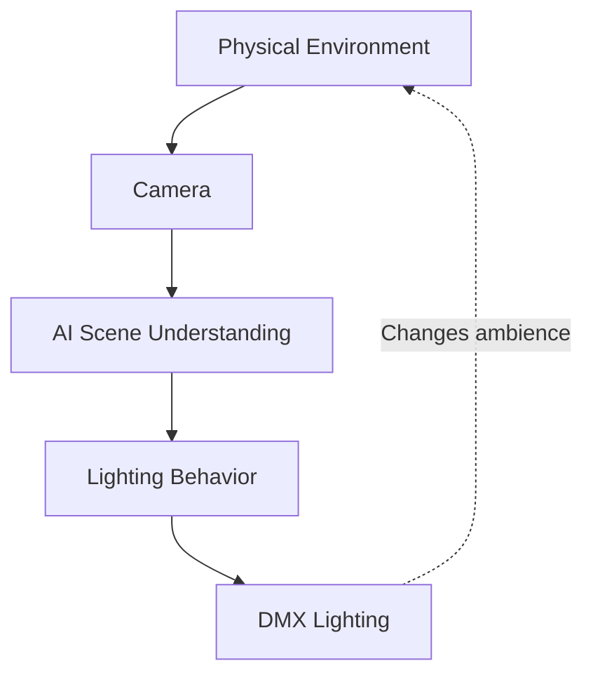
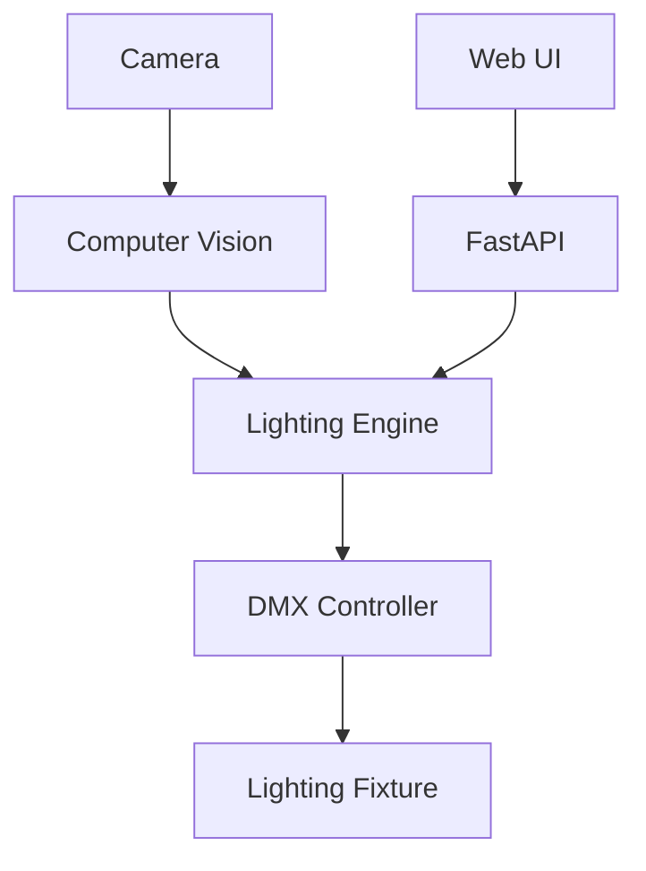

# AI for Physical Experience #01

## Adaptive Lighting

Adaptive Lighting is the first application of the broader **AI for Physical Experience** project.

It explores how humans and AI can collaborate to shape physical experiences through light, using rapid physical prototyping.

**Status:** 🚧 Early Prototype (2-week sprint)

## Project Goal

This project explores human-AI collaboration in physical environments by combining computer vision, scene understanding, and DMX lighting.

Rather than building a fully autonomous lighting system, the goal is to prototype interactions where AI helps people observe a space, interpret context, and make or refine lighting decisions.

## Why this Project?

Recent advances in AI have dramatically improved our ability to analyse images, understand language, and generate content.

Most AI applications remain screen-based, but this project explores how AI can extend into the physical world through lighting and tangible interaction.

The goal is to develop practical workflows for rapidly prototyping collaborative AI-powered physical experiences using accessible hardware and software.

## User Scenario

Imagine an exhibition technician preparing a gallery before visitors arrive.

Instead of manually testing multiple lighting scenes, the technician places a camera in the space and launches the prototype.

The system observes the environment, estimates the current context, and recommends an appropriate lighting behaviour.

The user can review, modify, or apply the recommendation before the lighting is updated.

The goal is not to replace creative judgement, but to accelerate experimentation during installation and testing.
## Interaction Model

## Architecture

## Technology Stack

| Layer | Technology |
|--------|------------|
| Frontend | HTML, CSS, JavaScript |
| Backend | FastAPI |
| AI | Computer Vision, Vision-Language Model |
| Hardware | USB Webcam, DMX Interface, LED Fixture |
| Version Control | GitHub |
## Roadmap

### Milestone 1
- Camera input
- Scene understanding
- DMX communication

### Milestone 2
- Lighting recommendation
- Web interface
- User testing
- Demo video
## Future Work

- Multi-light support
- Moving-head fixtures
- User-defined lighting styles
- Human-in-the-loop interaction
- User evaluation
- Spatial audio integration
- Integration with other AI for Physical Experience prototypes

---

## AI for Physical Experience Series

This repository is part of an ongoing research series exploring how humans and AI can collaborate to shape physical experiences through rapid prototyping.

Current projects:

- ✅ Adaptive Lighting
- ⬜ Adaptive Origami
- ⬜ Adaptive Ribbon
- ⬜ Adaptive Hair
- ⬜ Adaptive Projection
- ⬜ Adaptive Sound
